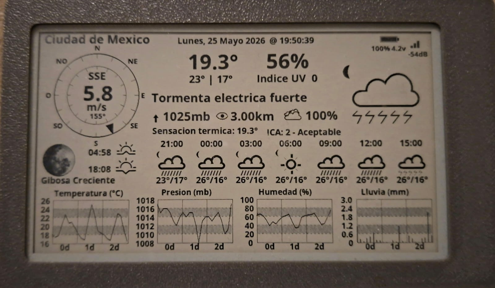

# LilyGo EPD 4.7" WeatherAPI Display (NoTouch)

**[Espanol](README.md)** | **[Francais](README_FR.md)**

ESP32-S3 weather station using the LilyGo T5 4.7" e-paper display. Fetches weather data from **WeatherAPI.com** and displays current conditions plus 3-day forecast.

## Features

- **Current Weather** - Temperature, humidity, pressure, wind speed/direction, UV index, air quality (AQI)
- **3-Day Forecast** - Hourly temperatures with weather icons
- **Astronomy Data** - Moon phase, sunrise/sunset times (real data from WeatherAPI)
- **Trend Graphs** - Temperature, pressure, humidity, precipitation over 3 days
- **Web Configuration** - Easy setup via captive portal (no code changes needed)
- **Multi-Language** - Spanish, English, French
- **Multi-WiFi** - Connects to strongest available network
- **Deep Sleep** - Battery efficient, configurable update interval
- **No Touch Required** - Single-screen display, no navigation needed

## Hardware

- **LilyGo T5 4.7" E-Paper (ESP32-S3)** - [Product Link](http://www.lilygo.cc/products/t5-4-7-inch-e-paper-v2-3)
- Display: 960x540 pixels, 16 grayscale levels
- This is the **non-touch** version

## Quick Start

### Arduino IDE Settings

| Setting | Value |
|---------|-------|
| Board | ESP32S3 Dev Module |
| USB CDC On Boot | Enable |
| Flash Size | 16MB (128Mb) |
| Partition Scheme | 16M Flash (3MB APP/9.9MB FATFS) |
| PSRAM | OPI PSRAM |
| Upload Mode | UART0/Hardware CDC |

### Required Libraries

| Library | Version | Source |
|---------|---------|--------|
| esp32 (Board Manager) | 2.0.17 | Espressif Systems |
| EPD47-master | Latest | [Download ZIP](https://github.com/DFRobotdl/EPD47/archive/refs/heads/master.zip) |
| ArduinoJson | 6.19.0 | Benoit Blanchon |

**Important:** Only install EPD47-master and ArduinoJson in the libraries folder to avoid conflicts.

**Alternative: Install via Web (no Arduino IDE needed)**

Use Chrome, Edge or Opera browser and connect device via USB.

### Firmware Updates (OTA)

| Method | URL / How to use |
|--------|------------------|
| **Web OTA** | `http://[DEVICE_IP]/ota` - Upload .bin from browser |
| **Arduino OTA** | Select "WeatherStation-NoTouch" network port in Arduino IDE |
| **Web Flasher** | [xe1e.github.io/LilyGo-EPD-4-7-WeatherAPI-Display-NoTouch](https://xe1e.github.io/LilyGo-EPD-4-7-WeatherAPI-Display-NoTouch/) |
| **Releases** | [Download .bin files](https://github.com/XE1E/LilyGo-EPD-4-7-WeatherAPI-Display-NoTouch/releases) |

### First Boot Configuration

On first power-up, the device automatically detects no configuration and enters **initial setup mode** (no timeout):

1. Connect to WiFi network: `WeatherStation-Setup`
2. Password: `weather123`
3. Open browser: `http://192.168.4.1`
4. **Test WiFi** - Button to verify the network exists
5. **Test API** - Button to validate your API key before saving
6. Enter your settings (API keys, location, etc.)
7. Click Save - device automatically restarts in 5 seconds

**Configuration modes:**
| Mode | When it occurs | Timeout |
|------|----------------|---------|
| Initial Setup | First boot, no config | No limit |
| Recovery Mode | WiFi connection fails | 5 minutes |
| Forced Mode | `FORCE_AP_MODE=true` | No limit |

### Get Your API Key

1. Go to [weatherapi.com](https://www.weatherapi.com/)
2. Sign up for a free account
3. Copy your API key from the dashboard
4. Enter it in the web configuration

### Normal Operation

1. Wakes from deep sleep
2. Connects to strongest configured WiFi network
3. Fetches weather from WeatherAPI.com (current + 3-day forecast + AQI)
4. Updates e-paper display
5. Returns to deep sleep

## Configuration Options

| Option | Description | Example |
|--------|-------------|---------|
| WiFi SSID/Password | Up to 3 networks | MyNetwork / mypassword |
| API Key | WeatherAPI.com API key | abc123def456... |
| City | Location name (display only) | Mexico City |
| Latitude | Location latitude | 19.4326 |
| Longitude | Location longitude | -99.1332 |
| Timezone | POSIX timezone string | CST6CDT |
| Update Interval | Minutes between updates | 60 |
| Language | ES, EN, or FR | ES |
| Units | M (Metric) or I (Imperial) | M |

### Settings Application

| Applies immediately | Requires reboot |
|--------------------|-----------------|
| Language | WiFi credentials |
| Units (C/F) | API Key |
| Update interval | Location/Coordinates |
| Active hours | Timezone |

## Troubleshooting

| Problem | Solution |
|---------|----------|
| Upload fails | Hold BOOT button, press RST, release RST, release BOOT, then upload |
| No WiFi connection | Check credentials, ensure 2.4GHz network, move closer to router |
| No weather data | Verify API key at weatherapi.com, check internet connection |
| Display not updating | Check deep sleep interval, verify power supply |
| "NoMemory" error | Normal for very large responses, alerts are disabled to save memory |

## Project Files

| File | Description |
|------|-------------|
| `LilyGo-EPD-4-7-WeatherAPI-Display.ino` | Main sketch |
| `owm_credentials.h` | Default WiFi/API configuration |
| `wifi_manager.h` | Web portal and AP mode |
| `forecast_record.h` | Weather data structures |
| `lang.h` | Multi-language strings |

## Technical Details

| Spec | Value |
|------|-------|
| Display | 960x540 pixels, 16 grayscale |
| MCU | ESP32-S3 with PSRAM |
| Power | ~15mA active, ~10uA deep sleep |
| API Calls | 1 call per update (includes current + forecast + AQI) |
| Max Response | ~50KB JSON (64KB buffer) |

## WeatherAPI vs OpenWeatherMap

This project uses **WeatherAPI.com** instead of OpenWeatherMap:

| Feature | WeatherAPI | OpenWeatherMap |
|---------|------------|----------------|
| API Calls | 1 (all data) | 3+ (current, forecast, AQI) |
| Moon Phase | Real data | Calculated |
| Sunrise/Sunset | String format | Unix timestamp |
| Free Tier | 1M calls/month | 1K calls/day |
| Alerts | Yes (disabled for memory) | Separate API |

## Documentation

- [Manual Espanol](MANUAL_ES.md)
- [English Manual](MANUAL_EN.md)
- [Manuel Francais](MANUAL_FR.md)

## License

MIT License - See [Licence.txt](Licence.txt)

## Credits

- Original project by David Bird
- ESP32 port by LilyGo
- WeatherAPI adaptation by XE1E
- Weather data from [WeatherAPI.com](https://www.weatherapi.com/)
